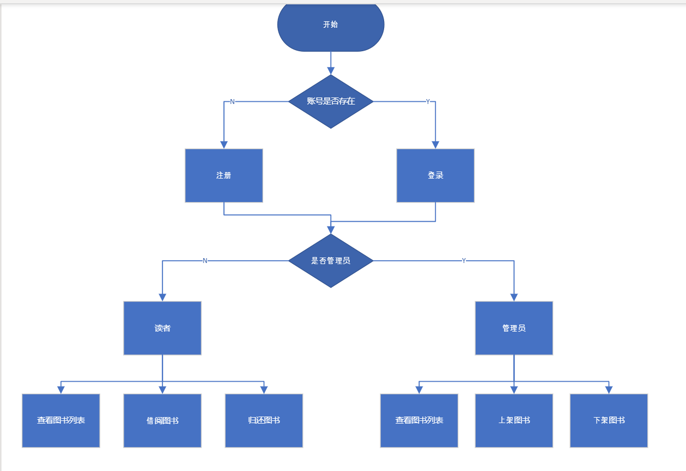
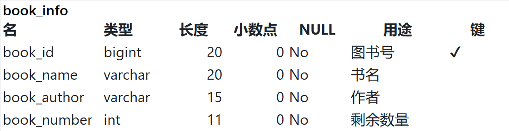
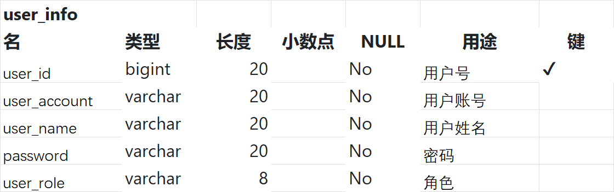
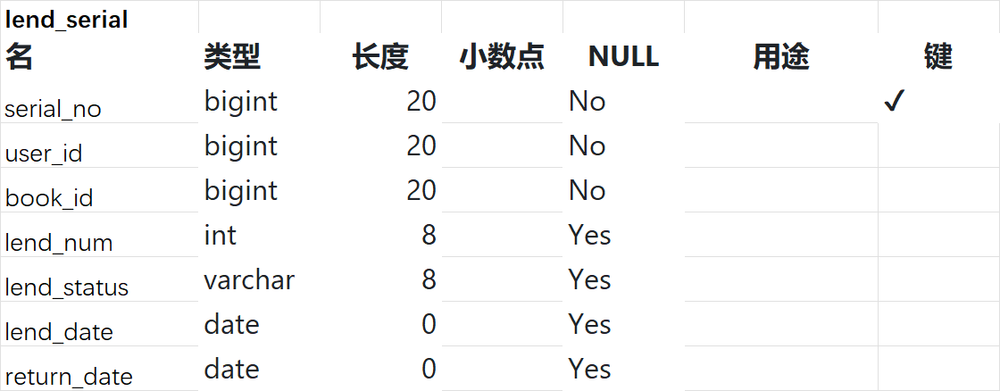

#Library Management System

##Summarize
This is a basic web project of library management. Base on web-service-DAO stractus.
However develop/20231127 has some bugs on web layer...

##business process

##Environment Configuration
jdk 1.8 + servlet + jsp
Please config your Tomcat before run 

###db.properties
Please modify db.properties into yours
url=
username=
password=

### Data Model
book_info

user_info

lend_serial

